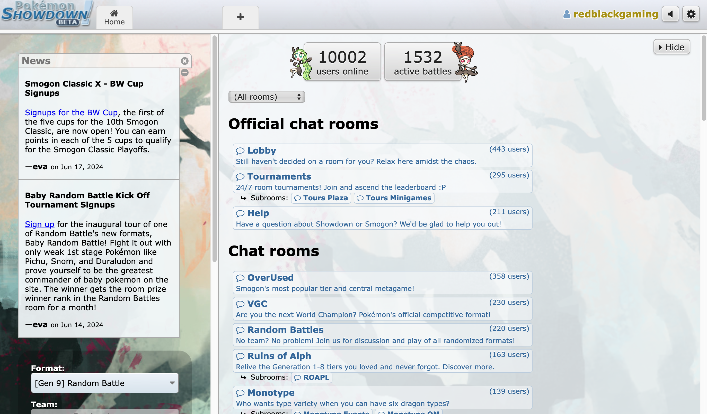
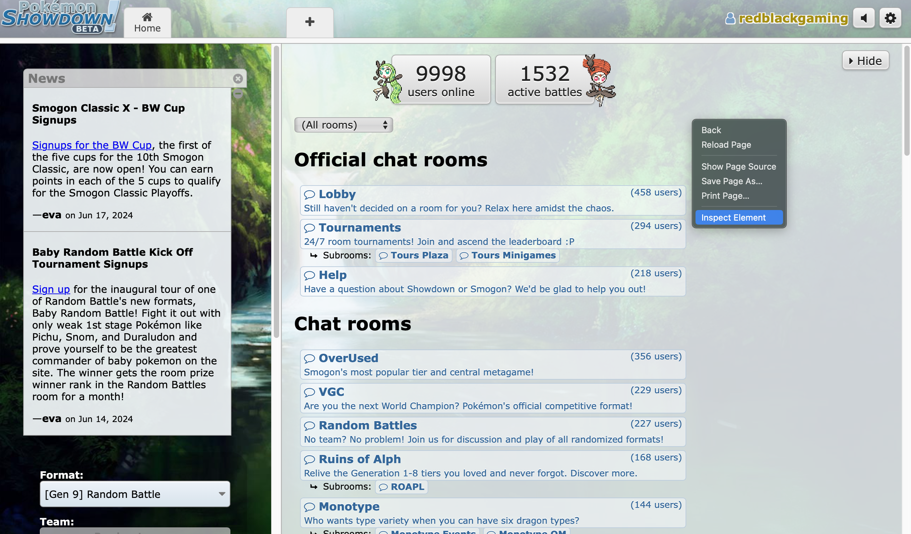
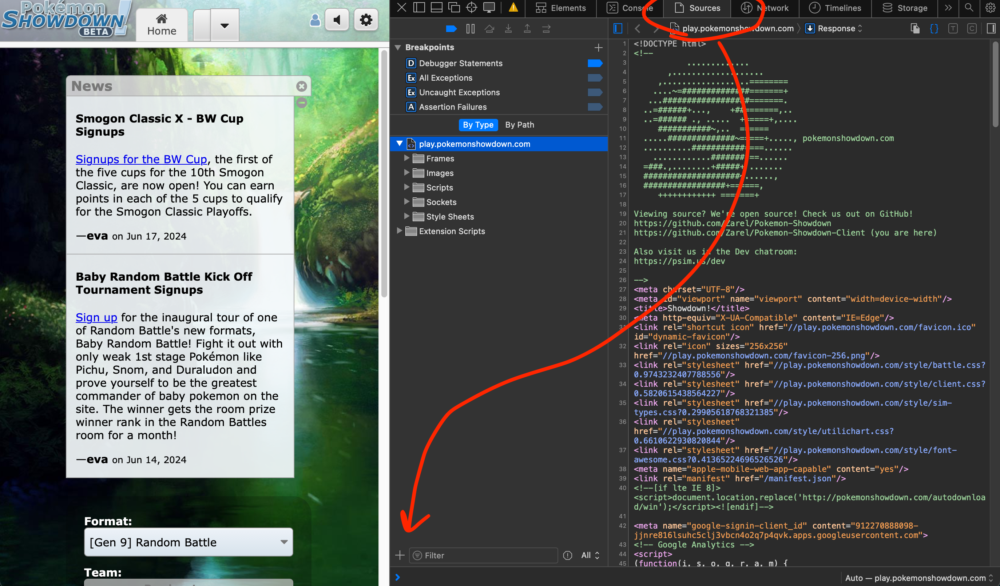
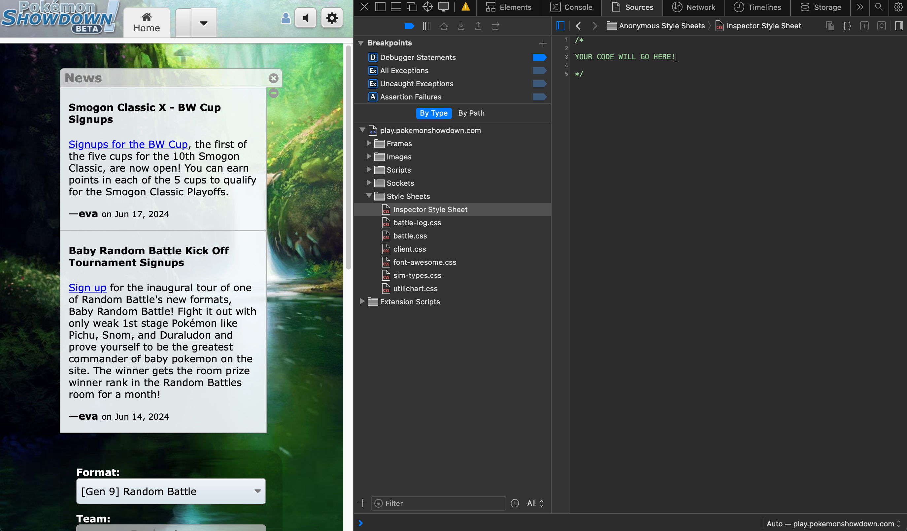
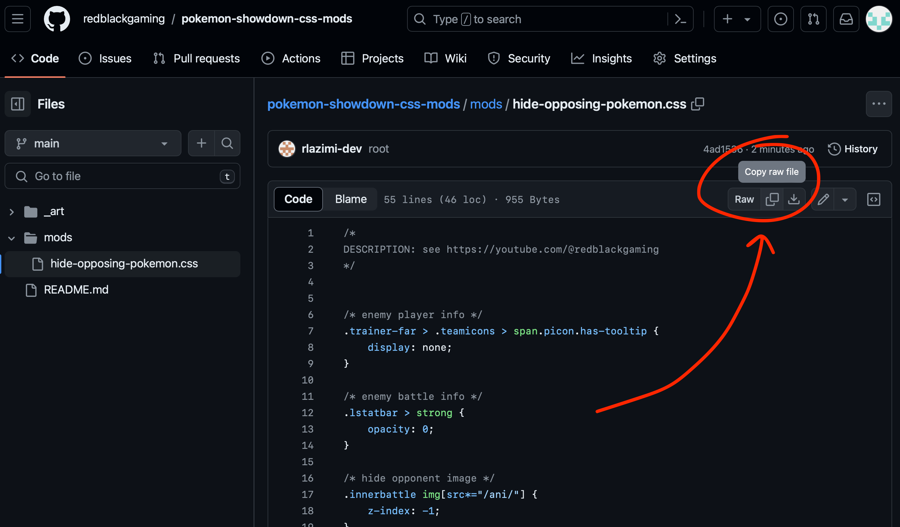
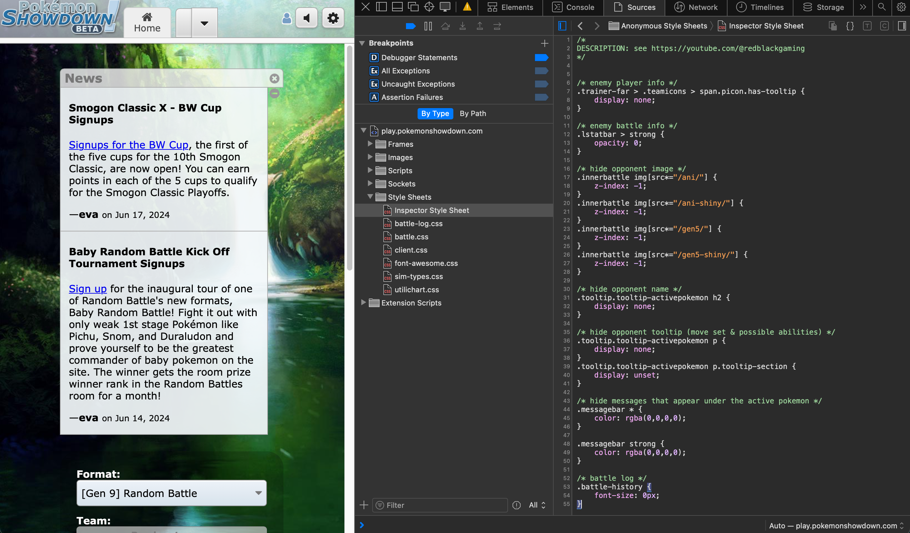
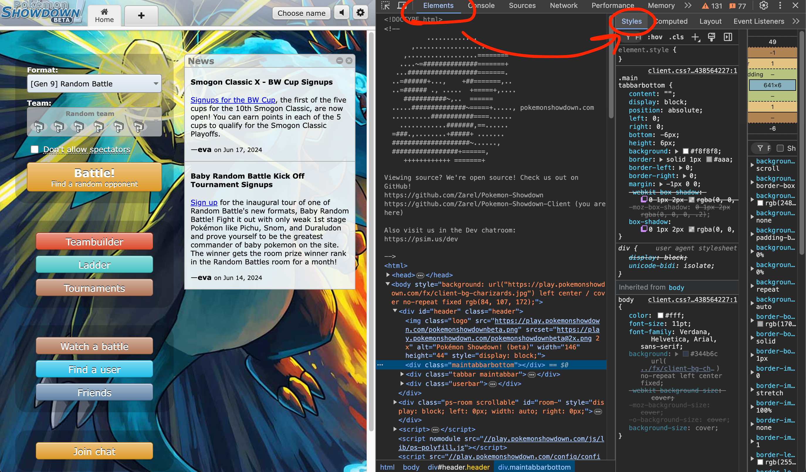
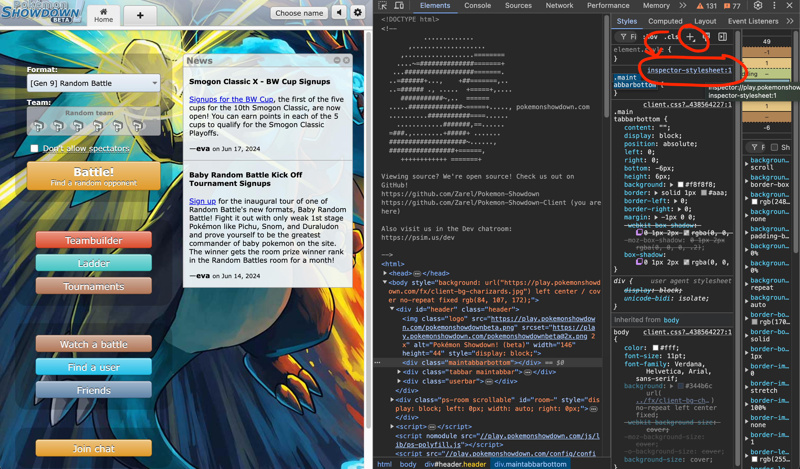
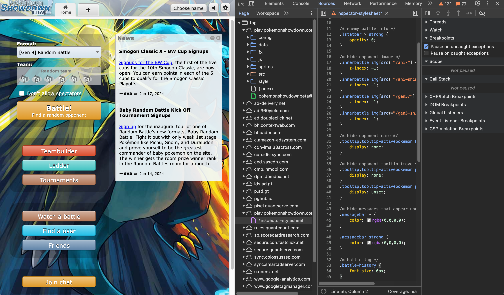

# Pokemon Showdown Visual Mods

Hello! This repo contains stylesheets meant to visually change a Pokemon showdown session enough for the session to be considered its own game mode

It is NOT meant to make showdown look better – in fact, the styles will likely sacrifice visual appeal for the sake of more difficult game play.

Watch my [YouTube video](https://youtube.com/@redblackgaming) about how I used one of these styles to hide my opponent's Pokemon in Showdown.

# How to Apply Styles (Safari)
1. open up [Pokemon Showdown](https://play.pokemonshowdown.com)

1. open up the Safari inspector

    1. right click anywhere on the page and select "Inspect Element"
    

    1. go to the "Sources" tab, and find the `+` button at the bottom left of the inspector and select "Inspector Style Sheet"
    

    1. note: this will open a new style sheet that you can start writing CSS to, now we need to grab the CSS:
    

1. in a new tab, navigate to the [github repo's `mods`](./mods) directory and locate the file you'd like to use, based on its name (or description inside the file)

1. copy the entire contents of the file:

1. navigate back to pokemon showdown, and paste the code

1. close the inspector, and now you're all set!

# How to Apply Styles (Chrome)
1. open up [Pokemon Showdown](https://play.pokemonshowdown.com)

1. open up the Chrome inspector

    1. right click anywhere on the page and select "Inspect"
    

    1. go to the "Elements" tab, and find the "Styles" section
    

    1. click the `+` button, which will create a new style sheet, and will provide a link to the sheet, which you can (and will) click
    

1. in a new tab, navigate to the [github repo's `mods`](./mods) directory and locate the file you'd like to use, based on its name (or description inside the file)

1. copy the entire contents of the file:

1. navigate back to pokemon showdown, and paste the code

1. close the inspector, and now you're all set!

# How to Apply (All Other Browsers)
If you're using another browser, I trust you either know or can figure out how to add a custom style sheet 😉.

# How to Contribute
1. fork the GitHub repo
2. create a new stylesheet in the [./mods](./mods) directory (please be descriptive in both the name of the file and through comments in the file); there must be a `DESCRIPTION` comment at the start of the file
3. make a PR into the main branch of this repo

I can't promise that I'll always be upkeeping this repo (unless it gets very popular), but at least for some time after my video goes live on YouTube, I will be merging PRs for more mods.